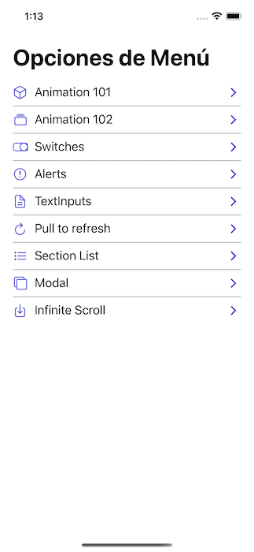
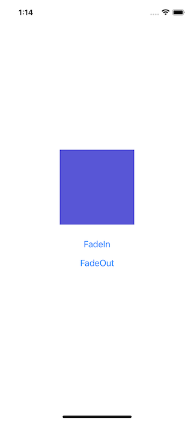
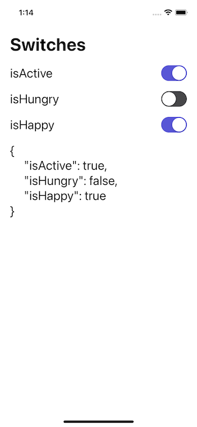

# React Native Components APP

Componets in React Native for IOS and Android

## Demo






## Installation

Install and initialize react-native-movies-app with npx

(You need emulators installed in your os previous to run this app)

First of all you have to clone this repo and then:

```bash
  cd react-native-rncomponents
  yarn install
  npx react-native run-ios
  npx react-native run-android
```
